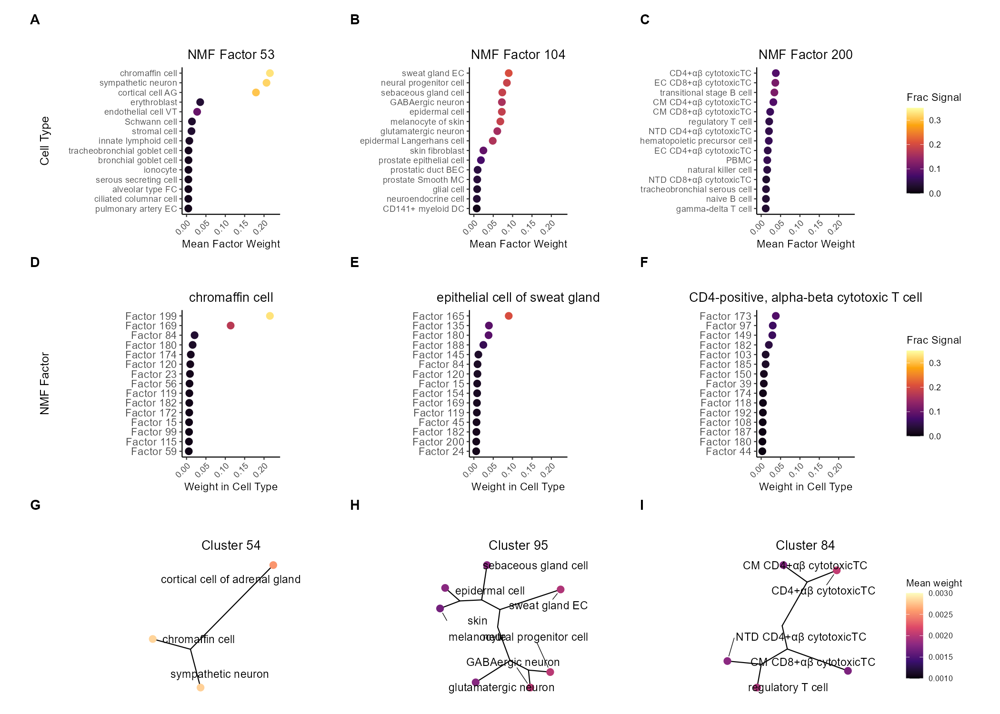
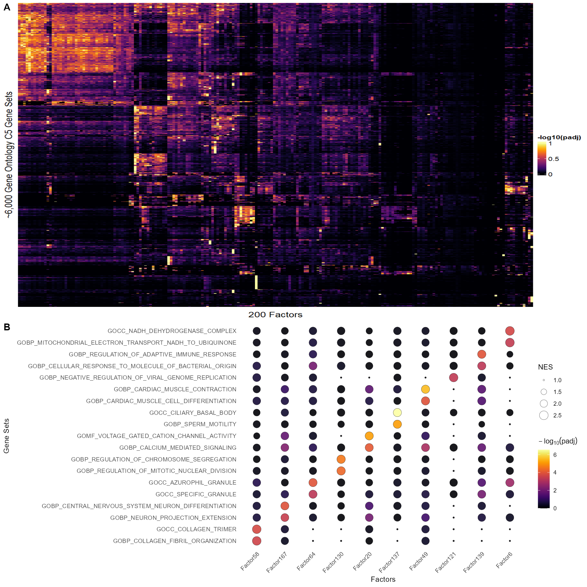
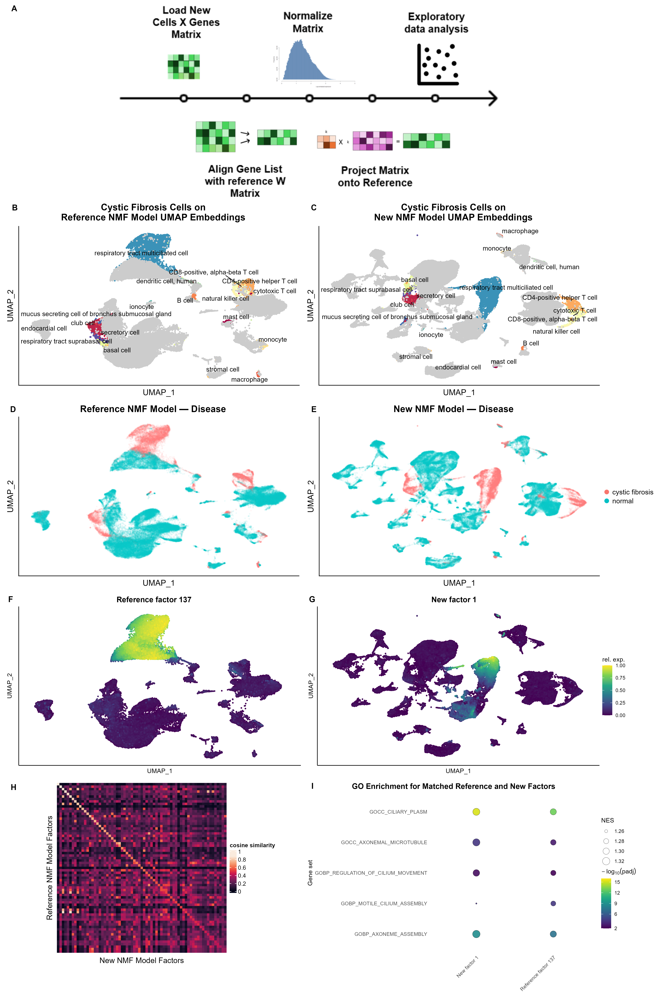

Figures – Code & Results
================

## Figure 2 – H matrix

Loading the necessary libraries for Figure 2.

``` r
library(ggplot2)
library(cowplot)
library(viridisLite)
library(ape)
library(ggtree)
library(ggrepel)
library(dplyr)
library(forcats)
library(stringr)
library(purrr)
library(tibble)
library(grid)

library(data.table)
library(singlet)
```

## Load embeddings

We read the embedding/metadata CSVs and drop the stray `V1` column if
present.  
This chunk only runs in *full* mode.

``` r
emb_path <- "/mnt/projects/debruinz_project/yu_ting/adata_obsm.csv"
obs_path <- "/mnt/projects/debruinz_project/yu_ting/adata_obs.csv"

emb <- fread(emb_path, header = TRUE)
obs <- fread(obs_path,  header = TRUE)


if ("V1" %in% names(emb)) emb[, V1 := NULL]
if ("V1" %in% names(obs)) obs[, V1 := NULL]

stopifnot(nrow(emb) == nrow(obs))

all_na <- rowSums(is.na(emb)) == ncol(emb)
emb    <- emb[!all_na]
obs    <- obs[!all_na]

emb_mat <- t(as.matrix(emb))
cell_types <- obs$cell_type

stopifnot(ncol(emb_mat) == length(cell_types))

summary_stats <- MetadataSummary(emb_mat, cell_types)
```

## Figure 2 — H matrix panels

We show three example factors, their top cell types and their neighbor
relationships.

``` r
colnames(summary_stats) <- as.numeric(colnames(summary_stats)) + 1
mw <- t(summary_stats)
 # Panel A/B/C: NMF factor k = 53, 104, 200
make_panel <- function(k, show_legend = FALSE, drop_label = NULL, n = 15) {
  df <- data.frame(
    weight      = mw[k, ],
    orig_label  = colnames(mw),
    frac_signal = mw[k, ] / colSums(mw)
  ) %>%
    { if (!is.null(drop_label)) filter(., !orig_label %in% drop_label) else . } %>%
    arrange(desc(weight)) %>%
    slice_head(n = n) %>%
    arrange(weight) %>%
    mutate(
      cell_type = map_chr(orig_label, function(label) {
        if (label == "pulmonary artery endothelial cell") return("pulmonary artery EC")
        if (label == "ciliated columnar cell of tracheobronchial tree") return("ciliated columnar cell")
        if (label == "alveolar type 1 fibroblast cell") return("alveolar type FC")
        if (label == "endothelial cell of vascular tree") return("endothelial cell VT")
        if (label == "cortical cell of adrenal gland") return("cortical cell AG")
        if (label == "epithelial cell of sweat gland") return("sweat gland EC")
        if (label == "epithelial cell of prostate") return("prostate epithelial cell")
        if (label == "basal epithelial cell of prostatic duct") return("prostatic duct BEC")
        if (label == "smooth muscle cell of prostate") return("prostate Smooth MC")
        if (label == "CD141-positive myeloid dendritic cell") return("CD141+ myeloid DC")
        if (label == "CD4-positive, alpha-beta cytotoxic T cell") return("CD4+αβ cytotoxicTC")
        if (label == "effector memory CD8-positive, alpha-beta T cell") return("EC CD8+αβ cytotoxicTC")
        if (label == "central memory CD4-positive, alpha-beta T cell") return("CM CD4+αβ cytotoxicTC")
        if (label == "central memory CD8-positive, alpha-beta T cell") return("CM CD8+αβ cytotoxicTC")
        if (label == "naive thymus-derived CD4-positive, alpha-beta T cell") return("NTD CD4+αβ cytotoxicTC")
        if (label == "effector memory CD4-positive, alpha-beta T cell") return("EC CD4+αβ cytotoxicTC")
        if (label == "naive thymus-derived CD8-positive, alpha-beta T cell") return("NTD CD8+αβ cytotoxicTC")
        if (label == "peripheral blood mononuclear cell") return("PBMC")
        return(label)
      }),
      cell_type = factor(cell_type, levels = unique(cell_type))
    )

  ggplot(df, aes(x = weight, y = cell_type, color = frac_signal)) +
    geom_point(size = 3) +
    scale_color_viridis_c(option = "B", limits = c(0, 0.35)) +
    scale_x_continuous(limits = c(0, 0.23)) +
    theme_classic() +
    labs(
      x     = "Mean Factor Weight",
      y     = "Cell Type",
      title = paste("NMF Factor", k),
      color = "Frac Signal"
    ) +
    theme(
      aspect.ratio    = 1.5,
      plot.margin     = margin(0.5, 0.5, 0.5, 0, "cm"),
      axis.text.y     = element_text(size = 9, hjust = 1),
      plot.title      = element_text(hjust = 0.5),
      legend.position = if (show_legend) "right" else "none",
      axis.text.x = element_text(angle = 45, hjust = 1)
    )
}

pA <- make_panel(53, show_legend = FALSE, drop_label = NULL, n = 15)

pB <- make_panel(104, show_legend = FALSE, drop_label = NULL, n = 15) +
        theme(axis.title.y = element_blank())

pC_with_legend <- make_panel(200, show_legend = TRUE, drop_label = "eukaryotic cell", n = 15)
legend_ABC      <- get_legend(pC_with_legend)

pC <- make_panel(200, show_legend = FALSE, drop_label = "eukaryotic cell", n = 15) +
        theme(axis.title.y = element_blank())

 # Panel D/E/F: per cell type ("chromaffin cell","epithelial cell of sweat gland", "CD4-positive, alpha-beta cytotoxic T cell")
make_cell_panel <- function(ct, show_legend = FALSE) {
  df <- data.frame(
    weight      = mw[, ct],
    factor      = rownames(mw)
  ) %>%
    mutate(frac_signal = weight / sum(weight)) %>%
    slice_max(order_by = weight, n = 15) %>%
    mutate(
      factor_label = paste("Factor", factor),
      factor_label = fct_reorder(factor_label, weight)
    )

  ggplot(df, aes(x = weight, y = factor_label, color = frac_signal)) +
    geom_point(size = 3) +
    scale_color_viridis_c(option = "B", limits = c(0, 0.35), direction = 1) +
    scale_x_continuous(limits = c(0, 0.23)) +
    theme_classic() +
    labs(
      title = ct,
      x     = "Weight in Cell Type",
      y     = "NMF Factor",
      color = "Frac Signal"
    ) +
    theme(
      aspect.ratio    = 1.5,
      plot.margin     = margin(0.5, 0.5, 0.5, 0, "cm"),
      axis.text.y     = element_text(size = 11, hjust = 1
    ),
      plot.title      = element_text(hjust = 0.5),
      legend.position = if (show_legend) "right" else "none",
      axis.text.x = element_text(angle = 45, hjust= 1),
    )
}

pD <- make_cell_panel("chromaffin cell",      show_legend = FALSE)
pE <- make_cell_panel("epithelial cell of sweat gland",     show_legend = FALSE) +
        theme(axis.title.y = element_blank(),  plot.margin  = margin(1.0, 0.5, 0.5, 0.5, "cm"))
pF <- make_cell_panel("CD4-positive, alpha-beta cytotoxic T cell", show_legend = FALSE) +
        theme(axis.title.y = element_blank())


legend_DEF <- get_legend(make_cell_panel("chromaffin cell", show_legend = TRUE))


# Panel G/H/I: unrooted tree of top cell types in clusters 54, 95, 84
dist_mat  <- dist(t(mw))
hc        <- hclust(dist_mat, method = "average")
phylo     <- as.phylo(hc)
clusters  <- cutree(hc, k = 100)
cell_mean <- rowMeans(summary_stats)


tree_label_map <- c(
  "CD4-positive, alpha-beta cytotoxic T cell"      = "CD4+αβ cytotoxicTC",
  "effector memory CD8-positive, alpha-beta T cell"= "EC CD8+αβ cytotoxicTC",
  "central memory CD4-positive, alpha-beta T cell" = "CM CD4+αβ cytotoxicTC",
  "central memory CD8-positive, alpha-beta T cell" = "CM CD8+αβ cytotoxicTC",
  "naive thymus-derived CD4-positive, alpha-beta T cell"   = "NTD CD4+αβ cytotoxicTC",
  "effector memory CD4-positive, alpha-beta T cell"       = "EC CD4+αβ cytotoxicTC",
  "naive thymus-derived CD8-positive, alpha-beta T cell"   = "NTD CD8+αβ cytotoxicTC",
  "epithelial cell of sweat gland"   = "sweat gland EC",
  "melanocyte of skin"   = "skin\nmelanocyte",
  "neural progenitor cell" = "neural progenitor cell"
)


cluster_ids <- c(54, 95, 84)
panel_let   <- c("G", "H", "I")
plots_GHI   <- list()

   for (i in seq_along(cluster_ids)) {
  k2  <- cluster_ids[i]
  let <- panel_let[i]

  tips_k <- phylo$tip.label[clusters == k2]
  if (length(tips_k) < 2) next

  n_tips <- if      (k2 == 84) 5
            else if (k2 == 95) 7
            else               10

 
  dfk <- tibble(
    orig_label = tips_k,
    mean_w     = cell_mean[tips_k]
  ) %>%
    arrange(desc(mean_w)) %>%
    slice_head(n = n_tips) %>%
    mutate(disp_label = recode(orig_label, !!!tree_label_map))

     subtree <- drop.tip(phylo, setdiff(phylo$tip.label, dfk$orig_label))

     p_base <- ggtree(subtree, layout="unrooted", branch.length="none") %<+% dfk +
       geom_tippoint(aes(color = mean_w), size = 3) +
       scale_color_viridis_c(option="magma",
                            name   = "Mean weight",
                            limits = c(0.001, 0.0035)) +
       theme_void() +
       ggtitle(paste("Cluster", k2)) +
       theme(
        plot.title      = element_text(hjust = 0.5),
        legend.position = "none",
        plot.margin     = unit(c(0, 0, 0, 0), "cm")
       )

     tip_coords <- p_base$data %>% filter(isTip)
     p_final <- p_base +
       geom_text_repel(
         data          = tip_coords,
         aes(x = x, y = y, label = disp_label),
         inherit.aes   = FALSE,
         size          = 4,
         force         = 8,            
         box.padding   = unit(0.6, "lines"),
         point.padding = unit(0.6, "lines"),
         segment.size  = 0.3,
         max.overlaps  = Inf,
         max.time      = 2             
       ) +
       scale_x_continuous(expand = expansion(mult = c(0, 0.3))) +
       scale_y_continuous(expand = expansion(mult = c(0.1, 0.1))) +
       coord_cartesian(clip = "off")

     plots_GHI[[let]] <- p_final
   }


df_ref <- tibble(
  label  = phylo$tip.label[clusters == 54],
  mean_w = cell_mean[phylo$tip.label[clusters == 54]]
) %>%
  arrange(desc(mean_w)) %>%
    slice_head(n = 10)

sub_ref <- drop.tip(phylo, setdiff(phylo$tip.label, df_ref$label))

p_ref_legend <- ggtree(sub_ref, layout = "unrooted", branch.length = "none") %<+% df_ref +
  geom_tippoint(aes(color = mean_w), size = 3) +
  scale_color_viridis_c(
    option = "magma",
    name   = "Mean weight",
    limits = c(0.001, 0.003)
  ) +
  theme_void() +
  ggtitle("Cluster 54") +
  theme(
    plot.title      = element_text(hjust = 0.5),
    legend.position = "right",
    plot.margin     = unit(c(1, 2, 1, 1), "cm"),
    legend.title    = element_text(size = 10),
    legend.text     = element_text(size = 8)
  )

legend_GHI <- get_legend(p_ref_legend)


pA2 <- pA + theme(axis.title.y = element_blank())
pD2 <- pD + theme(axis.title.y = element_blank())

make_title_panel <- function(txt){
  ggdraw() +
    draw_label(txt, angle = 90, fontface = "plain", size = 12,
               hjust = 0.5, vjust = 0.5) +
    theme(plot.margin = margin(0,0,0,0))
}

pCT   <- make_title_panel("Cell Type")
pNMF  <- make_title_panel("NMF Factor")
blank <- make_title_panel("")    


figure_full <- plot_grid(
  pCT,    pA2,          pB,          pC,          legend_ABC,
  pNMF,   pD2,          pE,          pF,          legend_DEF,
  blank,  plots_GHI$G,  plots_GHI$H,  plots_GHI$I,  legend_GHI,
  ncol        = 5,
  nrow        = 3,
  rel_widths  = c(0.3, 1, 1, 1, 0.25),
  rel_heights = c(1,   1, 1),
  align       = "hv",
  axis        = "tblr",
  labels      = NULL    
)

figure_full <- ggdraw() +
  
  draw_plot(figure_full,
            x      = -0.05,   
            y      = -0.05,   
            width  = 1.02,    
            height = 1.02     
  ) +

  draw_plot_label(
    label = c("A","B","C",
              "D","E","F",
              "G","H","I"),
    x     = c(0.03, 0.35, 0.64,
              0.03, 0.35, 0.64,
              00.03, 0.35, 0.64),
    y     = c(0.98, 0.98, 0.98,
              0.64, 0.64, 0.64,
              0.30, 0.30, 0.30),
    hjust = 0,
    vjust = 1,
    size  = 14
  ) +
  
  theme(plot.margin = margin(0, 0, 0, 0, "cm"))

figure_full
```

<!-- -->

``` r

ggsave("Figure2.pdf",
       figure_full,
       width  = 13,
       height = 10,
       units  = "in",
       dpi    = 300)
```

## Figure 3 – W matrix

Loading the necessary libraries for Figure 3

``` r
library(ComplexHeatmap)
library(circlize)   
library(viridis)     
library(grid)        
library(png)         
library(cowplot)     
library(dplyr)
library(ggplot2)
library(matrixStats)

library(msigdbr)
library(fgsea)
library(dplyr)
library(tidyr)
library(BiocParallel)
```

## Fgsea analysis for Figure 3 panel A

This chunk only runs in *full* mode.

``` r
main_dir <- "/mnt/projects/debruinz_project/yu_ting"

var_data <- read.csv(
  file.path(main_dir, "adata_var_metadata_unique.csv"),
  stringsAsFactors = FALSE
)

emb_raw <- read.csv(
  file.path(main_dir, "adata_var_embeddings_unique.csv"),
  stringsAsFactors = FALSE
)


stopifnot(nrow(var_data) == nrow(emb_raw))


msigdbr_df   <- msigdbr(species = "Homo sapiens", category = "C5")
msigdbr_list <- split(msigdbr_df$gene_symbol, msigdbr_df$gs_name)


n_factors <- ncol(emb_raw)
all_fgsea <- vector("list", length = n_factors)
bp        <- MulticoreParam(workers = 30)


for (i in seq_len(n_factors)) {
  factor_name <- colnames(emb_raw)[i]

  
  rv <- emb_raw[[i]] %>% as.numeric()
  names(rv) <- var_data$feature_name
  rv <- sort(rv[rv != 0], decreasing = TRUE)

  
  fg <- fgsea(
    pathways  = msigdbr_list,
    stats     = rv,
    eps       = 0.0,
    scoreType = "pos",
    minSize   = 25,
    maxSize   = 500,
    BPPARAM   = bp
  )

 
  all_fgsea[[i]] <- fg %>%
    select(pathway, NES, padj) %>%
    mutate(factor = factor_name)
}

combined <- bind_rows(all_fgsea)

nes_mat <- combined %>%
  select(pathway, factor, NES) %>%
  pivot_wider(names_from = factor, values_from = NES) %>%
  arrange(pathway)

padj_mat <- combined %>%
  select(pathway, factor, padj) %>%
  pivot_wider(names_from = factor, values_from = padj) %>%
  arrange(pathway)
```

## Figure 3 — W matrix panel A

The overall heatmap of genes sets and factors.

``` r
if (!exists("padj_mat")) padj_mat <- padj_all
if ("pathway" %in% colnames(padj_mat)) {
  padj_mat <- tibble::column_to_rownames(as.data.frame(padj_mat), "pathway")
} else {
  padj_mat <- as.data.frame(padj_mat)
}

padj_mat[] <- lapply(padj_mat, function(x) as.numeric(as.character(x)))
padj_mat[ is.na(padj_mat) ] <- 1
rows_to_keep      <- apply(padj_mat, 1, function(x) any(x < 0.001))
padj_mat_filtered <- padj_mat[rows_to_keep, , drop = FALSE]
padj_matrix <- as.matrix(padj_mat_filtered)
all_pos     <- padj_matrix[padj_matrix > 0]
smallest    <- min(all_pos, na.rm = TRUE)
padj_matrix[padj_matrix == 0] <- smallest
logp_matrix <- -log10(padj_matrix)

row_mins <- apply(logp_matrix, 1, min)
row_maxs <- apply(logp_matrix, 1, max)

logp_row_scaled <- logp_matrix
for (i in seq_len(nrow(logp_matrix))) {
  range_i <- row_maxs[i] - row_mins[i]
  if (range_i == 0) {
    logp_row_scaled[i, ] <- 0
  } else {
    logp_row_scaled[i, ] <- (logp_matrix[i, ] - row_mins[i]) / range_i
  }
}


col_fun <- colorRamp2(seq(0,1,length.out=100), viridis(100, option="B"))

pA <- Heatmap(
  logp_row_scaled,
  name = "-log10(padj)",
  col  = col_fun,
  cluster_rows      = TRUE,
  cluster_columns   = TRUE,
  show_row_names    = FALSE,
  show_column_names = FALSE,
  row_title         = "~6,000 Gene Ontology C5 Gene Sets",
  column_title      = "200 Factors",
  column_title_side = "bottom",
  show_row_dend     = FALSE,
  show_column_dend  = FALSE,
  use_raster        = FALSE,
  heatmap_legend_param = list(
    title  = "-log10(padj)",
    at     = c(0, 0.5, 1),
    labels = c("0", "0.5", "1")
  ),
  column_names_gp = gpar(fontsize = 8)
)

# PANEL B: 9×19 bubble grid 
library(tibble)
library(dplyr)
library(tidyr)
library(ggplot2)
library(viridis)
```

## Fgsea analysis for Figure 3 panel B

This chunk only runs in *full* mode.

``` r
main_dir <- "/mnt/projects/debruinz_project/yu_ting"

var_data <- read.csv(file.path(main_dir, "adata_var_metadata_unique.csv"),
                     stringsAsFactors = FALSE)
emb_raw  <- read.csv(file.path(main_dir, "adata_var_embeddings_unique.csv"),
                     stringsAsFactors = FALSE)
stopifnot(nrow(var_data) == nrow(emb_raw))


msigdbr_df   <- msigdbr(species = "Homo sapiens", category = "C5")
msigdbr_list <- split(msigdbr_df$gene_symbol, msigdbr_df$gs_name)


gs_sizes     <- lengths(msigdbr_list)
msigdbr_list <- msigdbr_list[gs_sizes <= 300]

n_factors <- ncol(emb_raw)
all_fgsea <- vector("list", n_factors)
bp        <- SerialParam()  

for (i in seq_len(n_factors)) {
  f_name <- colnames(emb_raw)[i]

  
  rv <- as.numeric(emb_raw[[i]])
  names(rv) <- var_data$feature_name
  rv <- rv[is.finite(rv) & rv != 0]
  if (length(rv) < 25) next
  set.seed(42)
  rv <- rv + rnorm(length(rv), sd = .Machine$double.eps)
  rv <- sort(rv, decreasing = TRUE)

  fg <- fgsea(
    pathways  = msigdbr_list,
    stats     = rv,
    eps       = 0.0,
    scoreType = "pos",
    minSize   = 25,
    maxSize   = 300,
    BPPARAM   = bp
  )

  all_fgsea[[i]] <- fg %>%
    select(pathway, NES, padj) %>%
    mutate(factor = f_name)
}


combined <- bind_rows(all_fgsea)
sig_counts <- combined %>%
  group_by(pathway) %>%
  summarize(n_sig = sum(padj < 0.05), .groups = "drop")

combined <- combined %>%
  filter(pathway %in% sig_counts$pathway[sig_counts$n_sig <= 50])


nes_mat_narrow <- combined %>%
  select(pathway, factor, NES) %>%
  pivot_wider(names_from = factor, values_from = NES) %>%
  arrange(pathway)

padj_mat_narrow <- combined %>%
  select(pathway, factor, padj) %>%
  pivot_wider(names_from = factor, values_from = padj) %>%
  arrange(pathway)


nes_mat2 <- nes_mat_narrow %>%
  column_to_rownames("pathway")

var_nes <- apply(nes_mat2, 1, var, na.rm = TRUE)

q25 <- quantile(var_nes, 0.25, na.rm = TRUE)

keep_var <- names(var_nes)[!is.na(var_nes) & var_nes >= q25]

nes_mat_narrow  <- nes_mat_narrow  %>% filter(pathway %in% keep_var)
padj_mat_narrow <- padj_mat_narrow %>% filter(pathway %in% keep_var)
```

## Figure 3 — W matrix panel B

The bubble plot of discriminative factors and pathways.

``` r
if (!exists("padj_mat_narrow")) padj_mat_narrow <- padj_narrow
if (!exists("nes_mat_narrow"))  nes_mat_narrow  <- nes_narrow

if ("pathway" %in% colnames(padj_mat_narrow))
  padj_mat_narrow <- padj_mat_narrow %>% tibble::column_to_rownames("pathway")
if ("pathway" %in% colnames(nes_mat_narrow))
  nes_mat_narrow  <- nes_mat_narrow  %>% tibble::column_to_rownames("pathway")

padj_mat_narrow[ is.na(padj_mat_narrow) ] <- 1
rows_to_keep      <- apply(padj_mat_narrow, 1, function(x) any(x < 0.001))
padj_mat_filtered <- padj_mat_narrow[rows_to_keep, , drop = FALSE]

padj_mat_filtered <- padj_mat_filtered[!grepl("^HP", rownames(padj_mat_filtered)), , drop = FALSE]
padj_matrix <- as.matrix(padj_mat_filtered)
all_pos     <- padj_matrix[padj_matrix > 0]
smallest    <- min(all_pos, na.rm = TRUE)
padj_matrix[padj_matrix == 0] <- smallest
logp_matrix <- -log10(padj_matrix)

nes_mat_narrow[is.na(nes_mat_narrow)] <- 0
nes_mat_narrow <- nes_mat_narrow[!grepl("^HP", rownames(nes_mat_narrow)), , drop = FALSE]
er_mat <- nes_mat_narrow + 1
nes_matrix  <- as.matrix(er_mat)

# vector of pathways to drop (generic)
drop_paths <- c(
  "GOBP_CILIUM_MOVEMENT",
  "GOBP_CYTOPLASMIC_TRANSLATION",
  "GOCC_CYTOSOLIC_RIBOSOME",
  "GOCC_MOTILE_CILIUM",
  "GOCC_RIBOSOMAL_SUBUNIT",
  "GOCC_RIBOSOME",
  "GOMF_STRUCTURAL_CONSTITUENT_OF_RIBOSOME",
  "GOCC_CONTRACTILE_FIBER",
  "GOCC_CYTOPLASMIC_REGION",
  "GOCC_LARGE_RIBOSOMAL_SUBUNIT",
  "GOBP_DNA_DEPENDENT_DNA_REPLICATION",
  "GOBP_DNA_PACKAGING",
  "GOBP_DOUBLE_STRAND_BREAK_REPAIR",
  "GOBP_CYTOPLASMIC_TRANSLATION",
  "GOBP_RRNA_METABOLIC_PROCESS",
  "GOBP_CELLULAR_RESPIRATION",
  "GOBP_AEROBIC_RESPIRATION",
  "GOBP_OXIDATIVE_PHOSPHORYLATION",
  "GOBP_ATP_SYNTHESIS_COUPLED_ELECTRON_TRANSPORT",
  "GOBP_ELECTRON_TRANSPORT_CHAIN",
  "GOBP_RESPIRATORY_ELECTRON_TRANSPORT_CHAIN",
  "GOBP_MEIOTIC_CELL_CYCLE",
  "GOBP_MEIOTIC_CELL_CYCLE_PROCESS",
  "GOBP_MICROTUBULE_CYTOSKELETON_ORGANIZATION_INVOLVED_IN_MITOSIS",
  "GOBP_MITOTIC_SISTER_CHROMATID_SEGREGATION",
  "GOBP_SPINDLE_ORGANIZATION",
  "GOCC_CYTOSOLIC_RIBOSOME",
  "GOCC_ORGANELLAR_RIBOSOME",
  "GOCC_POLYSOME",
  "GOMF_STRUCTURAL_CONSTITUENT_OF_RIBOSOME",
  "GOMF_ELECTRON_TRANSFER_ACTIVITY",
  "GOMF_PROTON_TRANSMEMBRANE_TRANSPORTER_ACTIVITY",
  "GOBP_ADENYLATE_CYCLASE_MODULATING_G_PROTEIN_COUPLED_RECEPTOR_SIGNALING_PATHWAY",
  "GOBP_CELL_CELL_ADHESION_VIA_PLASMA_MEMBRANE_ADHESION_MOLECULES",
  "GOBP_HOMOPHILIC_CELL_ADHESION_VIA_PLASMA_MEMBRANE_ADHESION_MOLECULES",
  "GOBP_MULTICELLULAR_ORGANISMAL_SIGNALING",
  "GOBP_REGULATION_OF_CHROMOSOME_ORGANIZATION",
  "GOBP_REGULATION_OF_RNA_SPLICING",
  "GOBP_HEART_PROCESS",
  "GOBP_MICROTUBULE_BASED_TRANSPORT",
  "GOBP_MICROTUBULE_BUNDLE_FORMATION",
  "GOBP_SISTER_CHROMATID_SEGREGATION",
  "GOCC_CATION_CHANNEL_COMPLEX",
  "GOCC_CHROMOSOME_CENTROMERIC_REGION",
  "GOCC_CONDENSED_CHROMOSOME",
  "GOCC_CYTOSOLIC_LARGE_RIBOSOMAL_SUBUNIT",
  "GOCC_ENDOPEPTIDASE_COMPLEX",
  "GOCC_NUCLEAR_CHROMOSOME",
  "GOCC_PEPTIDASE_COMPLEX",
  "GOCC_PROTEASOME_COMPLEX",
  "GOMF_EXTRACELLULAR_MATRIX_STRUCTURAL_CONSTITUENT",
  "HP_DECREASED_FERTILITY",
  "HP_INFERTILITY",
  "GOBP_REGULATION_OF_MUSCLE_SYSTEM_PROCESS",
  "GOBP_SODIUM_ION_TRANSMEMBRANE_TRANSPORT",
  "GOBP_SODIUM_ION_TRANSPORT",
  "GOCC_BLOOD_MICROPARTICLE",
  "GOCC_CONDENSED_CHROMOSOME_CENTROMERIC_REGION",
  "GOCC_CYTOSOLIC_SMALL_RIBOSOMAL_SUBUNIT",
  "GOCC_I_BAND",
  "GOCC_OXIDOREDUCTASE_COMPLEX",
  "GOCC_RESPIRASOME",
  "GOMF_LIGAND_GATED_ION_CHANNEL_ACTIVITY",
  "GOMF_MICROTUBULE_BINDING",
  "GOMF_PRIMARY_ACTIVE_TRANSMEMBRANE_TRANSPORTER_ACTIVITY",
  "GOMF_VOLTAGE_GATED_CHANNEL_ACTIVITY",
  "HP_ABNORMAL_MEAN_CORPUSCULAR_VOLUME",
  "HP_LEUKOPENIA",
  "GOCC_SMALL_RIBOSOMAL_SUBUNIT",
  "GOBP_ACTION_POTENTIAL",
  "GOBP_CELLULAR_COMPONENT_ASSEMBLY_INVOLVED_IN_MORPHOGENESIS",
  "GOBP_MITOTIC_SPINDLE_ORGANIZATION",
  "GOBP_POTASSIUM_ION_TRANSPORT",
  "GOBP_PROTON_TRANSMEMBRANE_TRANSPORT",
  "GOBP_REGULATED_EXOCYTOSIS",
  "GOBP_REGULATION_OF_BLOOD_CIRCULATION",
  "GOBP_REGULATION_OF_HEART_CONTRACTION",
  "GOBP_REGULATION_OF_MUSCLE_CONTRACTION",
  "GOBP_RESPONSE_TO_TOXIC_SUBSTANCE",
  "GOBP_STRIATED_MUSCLE_CONTRACTION",
  "GOCC_CHROMOSOME_TELOMERIC_REGION",
  "GOCC_ENDOPLASMIC_RETICULUM_PROTEIN_CONTAINING_COMPLEX",
  "GOCC_INNER_MITOCHONDRIAL_MEMBRANE_PROTEIN_COMPLEX",
  "GOCC_INTRINSIC_COMPONENT_OF_POSTSYNAPTIC_MEMBRANE",
  "GOCC_INTRINSIC_COMPONENT_OF_SYNAPTIC_MEMBRANE",
  "GOCC_MICROTUBULE_ASSOCIATED_COMPLEX",
  "GOCC_POSTSYNAPTIC_SPECIALIZATION_MEMBRANE",
  "GOCC_PRERIBOSOME",
  "GOCC_PROTEIN_DNA_COMPLEX",
  "GOMF_CALMODULIN_BINDING",
  "HP_HETEROGENEOUS",
  "HP_EMG_ABNORMALITY",
  "HP_PRENATAL_MATERNAL_ABNORMALITY",
  "GOBP_DENDRITE_DEVELOPMENT",
  "GOBP_DENDRITE_MORPHOGENESIS",
  "GOBP_GLIAL_CELL_DIFFERENTIATION",
  "GOBP_MYELOID_LEUKOCYTE_ACTIVATION",
  "GOBP_MYELOID_LEUKOCYTE_MIGRATION",
  "GOBP_NEURON_MIGRATION",
  "GOBP_NEUROTRANSMITTER_SECRETION",
  "GOBP_NEUROTRANSMITTER_TRANSPORT",
  "GOBP_POSITIVE_REGULATION_OF_SYNAPTIC_TRANSMISSION",
  "GOBP_POSTSYNAPSE_ORGANIZATION",
  "GOBP_REGULATION_OF_B_CELL_ACTIVATION",
  "GOBP_REGULATION_OF_POSTSYNAPTIC_MEMBRANE_POTENTIAL",
  "GOBP_REGULATION_OF_SYNAPSE_STRUCTURE_OR_ACTIVITY",
  "GOBP_REGULATION_OF_SYNAPTIC_PLASTICITY",
  "GOBP_SENSORY_PERCEPTION_OF_LIGHT_STIMULUS",
  "GOBP_SYNAPSE_ASSEMBLY",
  "GOBP_VESICLE_MEDIATED_TRANSPORT_IN_SYNAPSE",
  "GOBP_VIRAL_GENOME_REPLICATION",
  "GOCC_CILIARY_TIP",
  "GOCC_DISTAL_AXON",
  "GOCC_FICOLIN_1_RICH_GRANULE",
  "GOCC_INTRINSIC_COMPONENT_OF_POSTSYNAPTIC_SPECIALIZATION_MEMBRANE",
  "GOCC_NEURON_SPINE",
  "GOCC_POSTSYNAPTIC_DENSITY_MEMBRANE",
  "GOCC_PRESYNAPTIC_MEMBRANE",
  "GOCC_TERTIARY_GRANULE",
  "GOMF_EXTRACELLULAR_LIGAND_GATED_ION_CHANNEL_ACTIVITY",
  "GOMF_LIGAND_GATED_CATION_CHANNEL_ACTIVITY",
  "GOMF_NEUROTRANSMITTER_RECEPTOR_ACTIVITY",
  "GOMF_RNA_BINDING_INVOLVED_IN_POSTTRANSCRIPTIONAL_GENE_SILENCING",
  "GOMF_TRANSMITTER_GATED_CHANNEL_ACTIVITY"
)

factors_keep <- c(
  "Factor58","Factor167","Factor64","Factor130",
  "Factor20","Factor137","Factor49","Factor121",
  "Factor139","Factor6"
)

pathways_keep <- c(
  "GOBP_COLLAGEN_FIBRIL_ORGANIZATION",
  "GOCC_COLLAGEN_TRIMER",
  "GOBP_NEURON_PROJECTION_EXTENSION",
  "GOBP_CENTRAL_NERVOUS_SYSTEM_NEURON_DIFFERENTIATION",
  "GOCC_SPECIFIC_GRANULE",
  "GOCC_AZUROPHIL_GRANULE",
  "GOBP_REGULATION_OF_MITOTIC_NUCLEAR_DIVISION",
  "GOBP_REGULATION_OF_CHROMOSOME_SEGREGATION",
  "GOBP_CALCIUM_MEDIATED_SIGNALING",
  "GOMF_VOLTAGE_GATED_CATION_CHANNEL_ACTIVITY",
  "GOBP_SPERM_MOTILITY",
  "GOCC_CILIARY_BASAL_BODY",
  "GOBP_CARDIAC_MUSCLE_CELL_DIFFERENTIATION",
  "GOBP_CARDIAC_MUSCLE_CONTRACTION",
  "GOBP_NEGATIVE_REGULATION_OF_VIRAL_GENOME_REPLICATION",
  "GOBP_CELLULAR_RESPONSE_TO_MOLECULE_OF_BACTERIAL_ORIGIN",
  "GOBP_REGULATION_OF_ADAPTIVE_IMMUNE_RESPONSE",
  "GOBP_MITOCHONDRIAL_ELECTRON_TRANSPORT_NADH_TO_UBIQUINONE",
  "GOCC_NADH_DEHYDROGENASE_COMPLEX"
)


logp_matrix <- logp_matrix[!rownames(logp_matrix) %in% drop_paths, ]
nes_matrix  <- nes_matrix[ !rownames(nes_matrix)  %in% drop_paths, ]


plot_paths   <- intersect(pathways_keep, rownames(logp_matrix))
plot_factors <- intersect(factors_keep,  colnames(logp_matrix))

 
logp_sub <- logp_matrix[plot_paths, plot_factors, drop = FALSE]
nes_sub  <- nes_matrix[ plot_paths, plot_factors, drop = FALSE]


df_logp <- as.data.frame(logp_sub) %>%
  rownames_to_column("pathway") %>%
  pivot_longer(-pathway, names_to="factor", values_to="logp")
df_nes <- as.data.frame(nes_sub) %>%
  rownames_to_column("pathway") %>%
  pivot_longer(-pathway, names_to="factor", values_to="NES")


df <- full_join(df_logp, df_nes, by=c("pathway","factor")) %>%
  complete(pathway = plot_paths, factor = plot_factors) %>%
  replace_na(list(logp = 0, NES = 1)) %>%
  filter(!is.na(pathway) & !is.na(factor)) %>%
  mutate(
    pathway = factor(pathway, levels = plot_paths),
    factor  = factor(factor,  levels = plot_factors)
  ) %>%
  droplevels()


library(scales)


lp_min <- min(df$logp, na.rm = TRUE)
lp_max <- max(df$logp, na.rm = TRUE)

my_cols <- viridis(100, option = "B")

pB <- ggplot(df, aes(x = factor, y = pathway)) +
  geom_point(
    aes(size = NES, fill = logp),
    shape  = 21,
    color  = "black",
    stroke = 0.2,
    alpha  = 0.9
  ) +
  scale_fill_gradientn(
    name    = expression(-log[10](padj)),
    colours = my_cols,
    limits  = c(lp_min, lp_max),
    oob     = squish,            
    breaks  = seq(0, 6, by = 2)  
  ) +
  scale_size_continuous(
    name   = "NES",
    breaks = c(1.0, 1.5, 2.0, 2.5),
    labels = c("1.0", "1.5", "2.0", "2.5")
  ) +
  labs(x = "Factors", y = "Gene Sets") +
  theme_minimal() +
  theme(
    panel.grid  = element_blank(),
    axis.text.x = element_text(angle = 45, hjust = 1))
  

library(png)
tmpfile <- tempfile(fileext = ".png")
png(tmpfile, width = 1600, height = 1200, res = 150)


draw(pA, heatmap_legend_side = "right")
dev.off()
#> agg_png 
#>       2


img   <- readPNG(tmpfile)
pA_img <- rasterGrob(img, width = unit(1, "npc"), height = unit(1, "npc"))


Figure3 <- plot_grid(
  pA_img, pB,
  ncol        = 1,
  rel_heights = c(1.2, 1),     
  labels      = c("A","B"),
  label_size  = 14,
  align       = "v",
  axis        = "lr"
)

Figure3
```



``` r

ggsave(
  "Figure3.pdf",          
  plot   = Figure3,
  width  = 10,
  height = 12,
  device = "pdf",          
  bg     = "white"
)
```

## Figure 4 — Reference learning

Loading the necessary libraries for Figure 4.

``` r
library(Seurat)
library(cowplot)
library(magick)
library(ggplotify)    
library(grid)         
library(RColorBrewer)
library(ggplot2)
library(dplyr)
library(scales) 
library(ragg)         
library(png)
library(patchwork)    
library(AnnotationDbi)
library(org.Hs.eg.db)
library(msigdbr)
library(fgsea)
library(ggrepel)
library(tibble)
library(viridis)
library(clue)              
library(ComplexHeatmap)
library(circlize)
library(viridisLite)
```

## The Seurat object

Store the new NMF data, project NMF data and UMAP visulization.

``` r
library(reticulate)
use_virtualenv("r-reticulate", required = TRUE)
py_install(c("scanpy", "anndata"), envname = "r-reticulate", pip = TRUE)
sc    <- import("scanpy")
library(Matrix)
adata <- sc$read_h5ad(getp("200 factors W matrix", "transfer_learning_data.h5ad"))
counts_mat <- Matrix(adata$X, sparse = TRUE)
counts_mat <- t(counts_mat)

rownames(counts_mat) <- adata$var_names$to_list()  
colnames(counts_mat) <- adata$obs_names$to_list()  
dim(counts_mat)

seurat_obj <- CreateSeuratObject(
  counts    = counts_mat,
  project   = "transfer_learning",
  assay     = "RNA",
  min.cells = 3,
  min.features = 200
)

colnames(seurat_obj@meta.data)
obs_df  <- as.data.frame(py_to_r(adata$obs))
rownames(obs_df) <- adata$obs_names$to_list()
colnames(obs_df)
celltype_meta <- obs_df[, "cell_type", drop = FALSE]
all(rownames(celltype_meta) == colnames(seurat_obj))
disease_meta <- obs_df[, "disease", drop = FALSE]
all(rownames(disease_meta) == colnames(seurat_obj))

seurat_obj <- AddMetaData(
     object   = seurat_obj,
     metadata = celltype_meta
 )
celltype_meta <- seurat_obj@meta.data["cell_type"]
seurat_obj <- AddMetaData(
     object   = seurat_obj,
     metadata = disease_meta
 )
disease_meta <- seurat_obj@meta.data["disease"]

raw_counts <- GetAssayData(
     object = seurat_obj,
     assay  = "RNA",
     layer  = "counts"
 )


library(readr)
w_ref    <- readr::read_csv(getp("adata_var_embeddings_unique.csv"), show_col_types = FALSE)
var_meta <- readr::read_csv(getp("adata_var_metadata_unique.csv"),  show_col_types = FALSE)
intersect(rownames(raw_counts), var_meta$feature_id)
w_ref <- w_ref %>% mutate(index = row_number())
var_meta <- var_meta %>% mutate(index = row_number())
w_ref <- left_join(var_meta %>% select(index, feature_id),
                     w_ref,
                     by = "index")

w_ref_matrix <- w_ref %>%
  column_to_rownames(var = "feature_id") %>% 
  select(-index) %>%                           
  as.matrix()                                  

dim(w_ref_matrix)


common_genes <- intersect(rownames(raw_counts), rownames(w_ref_matrix))
length(common_genes) 
raw_counts_sub  <- raw_counts[common_genes,    , drop = FALSE]
w_ref_matrix_sub      <- w_ref_matrix[common_genes,  , drop = FALSE]
dim(raw_counts_sub)  
dim(w_ref_matrix_sub) 


counts_sub <- raw_counts_sub
seurat_norm <- CreateSeuratObject(
  counts    = counts_sub,
  assay     = "alignedRNA",
  project   = "transfer_learning"
)
seurat_norm <- AddMetaData(
     object   = seurat_norm,
     metadata = celltype_meta
 )

seurat_norm <- AddMetaData(
     object   = seurat_norm,
     metadata = disease_meta
 )

seurat_norm <- NormalizeData(
  seurat_norm,
  assay                 = "alignedRNA",
  normalization.method  = "LogNormalize",
  scale.factor          = 1e4
)

norm_mat <- GetAssayData(
  object = seurat_norm,
  assay  = "alignedRNA",
  layer  = "data"
)


library(singlet)
library(SingleCellExperiment)

cv_data <- cross_validate_nmf(
  A            = norm_mat,
  ranks        = 2:90,
  n_replicates = 1,
  trace_test_mse = 1,
  L1           = 0,
  tol          = -1,
  tol_overfit  = Inf
)
plot(cv_data)

best_rank <- 70
A <- as(norm_mat, "dgCMatrix")
set.seed(42)
nmf_mod <- run_nmf(
     A,               
     rank     = best_rank,
     verbose  = FALSE
)
W_deNovo <- nmf_mod$w    
H_deNovo <- nmf_mod$h   

library(Seurat)

colnames(H_deNovo) <- colnames(seurat_norm)
rownames(H_deNovo) <- paste0("NMF_", seq_len(nrow(H_deNovo)))   

rownames(W_deNovo) <- rownames(seurat_norm)
colnames(W_deNovo) <- rownames(H_deNovo)

seurat_norm[["nmf"]] <- CreateDimReducObject(
  embeddings = t(H_deNovo),   
  loadings   = W_deNovo,      
  key        = "NMF_",        
  assay      = "alignedRNA"   
)

seurat_norm <- RunUMAP(
  seurat_norm,
  reduction      = "nmf",
  dims           = 1:best_rank,
  reduction.name = "umap_nmf_new",
  reduction.key  = "UMAPnew_"
)

library(RcppML)

common_genes <- intersect(rownames(norm_mat), rownames(w_ref_matrix_sub))
A_sub <- norm_mat[common_genes,    , drop = FALSE]  
W_sub <-  w_ref_matrix_sub[common_genes, , drop = FALSE] 


H_proj <- project(A_sub, w = W_sub)

rownames(H_proj) <- paste0("NMFproj_", seq_len(nrow(H_proj)))    
colnames(H_proj) <- colnames(norm_mat)

seurat_norm[["nmf_proj"]] <- CreateDimReducObject(
  embeddings = t(H_proj),  
  loadings   = W_sub,      
  key        = "NMFproj_",
  assay      = "alignedRNA"
)


seurat_norm <- RunUMAP(
  seurat_norm,
  reduction      = "nmf_proj",
  dims           = 1:best_rank,
  reduction.name = "umap_proj",
  reduction.key  = "UMAPproj_"
)
```

## Figure 4 — Panels

Comparing the new NMF data and project NMF data in UMAP with cell types, diseases and factors. Also, the cosine similiarity heatmap arocss the factors. And the bubble plot of highly similiar factors.

``` r
# Panel B and C
cf_cells  <- WhichCells(seurat_norm, expression = disease == "cystic fibrosis")
ct_counts <- table(seurat_norm$cell_type[cf_cells])
threshold <- 90
freq_ct   <- names(ct_counts[ct_counts > threshold])


seurat_norm$ct_plot <- ifelse(
  seurat_norm$disease == "cystic fibrosis" & seurat_norm$cell_type %in% freq_ct,
  as.character(seurat_norm$cell_type),
  "Other"
)

seurat_norm$ct_plot <- factor(seurat_norm$ct_plot, levels = c(freq_ct, "Other"))


make_spectral <- function(n){
  if (n <= 11) brewer.pal(n, "Spectral") else colorRampPalette(brewer.pal(11, "Spectral"))(n)
}
pal_cf <- setNames(make_spectral(length(freq_ct)), freq_ct)
cols   <- c(pal_cf, Other = "grey80")


both      <- rbind(Embeddings(seurat_norm, "umap_proj"),
                   Embeddings(seurat_norm, "umap_nmf_new"))
lims_x <- range(both[,1]); lims_y <- range(both[,2])


p_proj <- DimPlot(
  seurat_norm,
  reduction = "umap_proj",
  group.by  = "ct_plot",
  cols      = cols,                                  
  order     = c("Other", as.character(freq_ct)),      
  label     = FALSE,
  pt.size   = 0.5
)


p_proj <- LabelClusters(
  p_proj,
  id       = "ct_plot",
  clusters = freq_ct,
  repel    = TRUE,
  size     = 4,
  max.overlaps = Inf
)


p_proj <- p_proj +
  ggtitle("Cystic Fibrosis Cells on\nReference NMF Model UMAP Embeddings") +
  labs(x = "UMAP_1", y = "UMAP_2") +
  theme(
    legend.position = "none",    
    axis.text.x     = element_blank(),
    axis.text.y     = element_blank(),
    axis.ticks.x    = element_blank(),
    axis.ticks.y    = element_blank(),
    panel.grid      = element_blank()
  ) + labs(tag = "B")

pB <- p_proj

p_new <- DimPlot(
  seurat_norm,
  reduction = "umap_nmf_new",
  group.by  = "ct_plot",
  cols      = cols,
  order     = c("Other", as.character(freq_ct)),
  label     = FALSE,
  pt.size   = 0.5
)

p_new <- LabelClusters(
  p_new,
  id       = "ct_plot",
  clusters = freq_ct,
  repel    = TRUE,
  size     = 4,
  max.overlaps = Inf
)


p_new <- p_new +
  ggtitle("Cystic Fibrosis Cells on\nNew NMF Model UMAP Embeddings") +
  labs(x = "UMAP_1", y = "UMAP_2") +
  theme(
    legend.position = "none",    
    axis.text.x     = element_blank(),
    axis.text.y     = element_blank(),
    axis.ticks.x    = element_blank(),
    axis.ticks.y    = element_blank(),
    panel.grid      = element_blank()
  ) +  labs(tag = "C")
pC <- p_new

# Panel D and E 
set_point_alpha <- function(p, a = 0.05) {
  p$layers[[1]]$aes_params$alpha <- a
  p
}


pD <- DimPlot(
  seurat_norm,
  reduction = "umap_proj",
  group.by  = "disease",
  pt.size   = 0.5,
  shuffle   = TRUE
) +
  ggtitle("Reference NMF Model — Disease") +
  scale_colour_manual(
    values = c("normal" = "#00BFC4", "cystic fibrosis" = "#F8766D"),
    guide  = guide_legend(override.aes = list(alpha = 1))   
  ) +
  labs(color = "Disease") +
  theme(
    plot.title      = element_text(hjust = 0.5, margin = margin(b = 5)),
    plot.tag.position = c(0.02, 0.98),
    plot.tag          = element_text(size = 14, face = "bold"),
    legend.position   = "none",                                 
    legend.key        = element_rect(fill = "white", colour = NA),
    axis.text.x = element_blank(), axis.text.y = element_blank(),
    axis.ticks.x = element_blank(), axis.ticks.y = element_blank()
  ) +
  labs(x = "UMAP_1", y = "UMAP_2")

pD <- set_point_alpha(pD, 0.05)


pE <- DimPlot(
  seurat_norm,
  reduction = "umap_nmf_new",
  group.by  = "disease",
  pt.size   = 0.5,
  shuffle   = TRUE
) +
  ggtitle("New NMF Model — Disease") +
  scale_colour_manual(
    values = c("normal" = "#00BFC4", "cystic fibrosis" = "#F8766D"),
    guide  = guide_legend(override.aes = list(alpha = 1))   
  ) +
  labs(tag = "E") +
  theme(
    plot.title      = element_text(hjust = 0.5, margin = margin(b = 5)),
    plot.tag.position = c(0.02, 0.98),
    plot.tag          = element_text(size = 14, face = "bold"),
    legend.position   = "right",
    legend.key        = element_rect(fill = "white", colour = NA),
    axis.text.x = element_blank(), axis.text.y = element_blank(),
    axis.ticks.x = element_blank(), axis.ticks.y = element_blank()
  ) +
  labs(x = "UMAP_1", y = "UMAP_2") +
  guides(colour = guide_legend(ncol = 1, override.aes = list(size = 3, alpha = 1)))  

pE <- set_point_alpha(pE, 0.05)


# Panel F and G 
set.seed(42)

scale01 <- function(x) (x - min(x)) / (max(x) - min(x))


H_mat_new  <- Embeddings(seurat_norm,  "nmf")
H_mat_proj <- Embeddings(seurat_norm, "nmf_proj")

seurat_norm@meta.data <- cbind(
  seurat_norm@meta.data,
  as.data.frame(H_mat_new[,  c("NMF_1")]),
  as.data.frame(H_mat_proj[, c("NMFproj_137")])
)

cn <- colnames(seurat_norm@meta.data)
cn[cn == 'H_mat_new[, c("NMF_1")]']        <- 'NMF_1'
cn[cn == 'H_mat_proj[, c("NMFproj_137")]'] <- 'NMFproj_137'
colnames(seurat_norm@meta.data) <- cn

for(col in c("NMF_1","NMFproj_137")) {
  vec_raw <- seurat_norm@meta.data[[col]]
  seurat_norm@meta.data[[paste0(col, "_01")]] <- scale01(vec_raw)
}


base_theme <- theme_minimal() +
  theme(
    panel.grid.major = element_blank(),
    panel.grid.minor = element_blank(),
    axis.line   = element_line(color = "black"),
    axis.text.x     = element_blank(),
    axis.text.y     = element_blank(),
    axis.ticks.x    = element_blank(),
    axis.ticks.y    = element_blank(),
    axis.title  = element_text(color = "black"),
    plot.title      = element_text(hjust = 0.5, margin = margin(b = 5), family = "Helvetica", face = "bold"),
    plot.tag.position = c(0.02, 0.98),
    plot.tag          = element_text(size = 14, face = "bold"),
    legend.position   = "right"
  )

pG <- FeaturePlot(
  seurat_norm, reduction = "umap_nmf_new",
  features  = "NMF_1_01",
  pt.size   = 0.5,
  order     = TRUE,
  combine   = FALSE
)[[1]] +
  scale_color_viridis_c(name = "rel. exp.", limits = c(0, 1)) +
  ggtitle("New factor 1") + 
  labs(x = "UMAP_1", y = "UMAP_2") + base_theme

pF <- FeaturePlot(
  seurat_norm, reduction = "umap_proj",
  features  = "NMFproj_137_01",
  pt.size   = 0.5,
  order     = TRUE,
  combine   = FALSE
)[[1]] +
  scale_color_viridis_c(name = "rel. exp.", limits = c(0, 1)) +
  ggtitle("Reference factor 137") + labs(tag = "F") +
  base_theme + labs(x = "UMAP_1", y = "UMAP_2")+ theme(legend.position = "none")

# Panel H
W_ref <- as.matrix(Loadings(seurat_norm[["nmf_proj"]]))  
W_new <- as.matrix(Loadings(seurat_norm[["nmf"]]    ))  


common_genes <- intersect(rownames(W_ref), rownames(W_new))
W_ref <- W_ref[common_genes, , drop = FALSE]
W_new <- W_new[common_genes, , drop = FALSE]
drop_zero <- function(M) M[rowSums(abs(M)) > 0, , drop = FALSE]
W_ref <- drop_zero(W_ref); W_new <- drop_zero(W_new)


unit_cols <- function(M){
  n <- sqrt(colSums(M^2)); n[n == 0] <- 1
  sweep(M, 2, n, "/")
}
R <- unit_cols(W_ref)
N <- unit_cols(W_new)
S <- t(R) %*% N                    


pad_to_square <- function(M, pad_value){
  nr <- nrow(M); nc <- ncol(M)
  if (nr == nc) return(M)
  if (nr > nc) cbind(M, matrix(pad_value, nrow = nr, ncol = nr - nc))
  else         rbind(M, matrix(pad_value, nrow = nc - nr, ncol = nc))
}
cost      <- max(S) - S
cost_pad  <- pad_to_square(cost, pad_value = max(cost) + 1)
assign_ix <- solve_LSAP(cost_pad)

k_ref <- nrow(S); k_new <- ncol(S)
match_vec <- as.integer(assign_ix[seq_len(k_ref)])
match_vec[match_vec > k_new] <- NA

matched_rows <- which(!is.na(match_vec))
pairs <- data.frame(
  ref_factor = colnames(W_ref)[matched_rows],
  new_factor = colnames(W_new)[match_vec[matched_rows]],
  ref_idx    = matched_rows,
  new_idx    = match_vec[matched_rows],
  cosine     = S[cbind(matched_rows, match_vec[matched_rows])]
)

pairs <- pairs[order(1 - pairs$cosine), ]     
ixr <- pairs$ref_idx
ixc <- pairs$new_idx

S_block <- S[ixr, ixc, drop = FALSE]
D_block <- 1 - S_block
rownames(D_block) <- paste0("NMFproj:", colnames(W_ref)[ixr])
colnames(D_block) <- paste0("NMFnew:",  colnames(W_new)[ixc])


col_fun <- colorRamp2(seq(min(S_block), max(S_block), length.out = 256), (rocket(256)))
nr <- nrow(S_block)
nc <- ncol(S_block)


cell_mm <- unit(1.5, "mm")   

pH <- Heatmap(
  S_block, name = "cosine similarity", col = col_fun,
  cluster_rows = FALSE, cluster_columns = FALSE,
  show_row_names = FALSE, show_column_names = FALSE,
  row_title = "Reference NMF Model Factors",
  column_title = "New NMF Model Factors",
  column_title_side = "bottom",
  rect_gp = gpar(col = NA),

  
  width  = cell_mm * nc,
  height = cell_mm * nr
)


gH <- grid.grabExpr(draw(pH, heatmap_legend_side = "right"))
pH <- ggdraw() + draw_plot(gH, 0, 0, 1, 1) + labs(tag = "H")

# Panel I
W_new  <- seurat_norm@reductions$nmf@feature.loadings       
W_proj <- seurat_norm@reductions$nmf_proj@feature.loadings  


sym_map <- mapIds(
  org.Hs.eg.db,
  keys      = rownames(W_new),
  column    = "SYMBOL",
  keytype   = "ENSEMBL",
  multiVals = "list"
)
make_sym_mat <- function(W) {
  as.data.frame(W, row.names = rownames(W)) %>%
    rownames_to_column("ENSEMBL") %>%
    mutate(symbol = sym_map[ENSEMBL]) %>%
    filter(!is.na(symbol)) %>%
    group_by(symbol) %>%
    summarise(across(-ENSEMBL, mean), .groups="drop") %>%
    column_to_rownames("symbol") %>%
    as.matrix()
}
W_new_sym  <- make_sym_mat(W_new)
W_proj_sym <- make_sym_mat(W_proj)


msigdbr_df <- msigdbr(
  species      = "Homo sapiens",
  collection   = "C5"
)%>%
 filter(gs_subcollection %in% c("GO:BP","GO:CC","GO:MF"))


gosets_bp <- with(
  msigdbr_df,
  split(gene_symbol, gs_name)
)


gosets_bp <- lapply(gosets_bp, unique)


gs_sizes <- lengths(gosets_bp)
gosets_filt <- gosets_bp[gs_sizes >= 20 & gs_sizes <= 200]

exclude <- c("STEM_CELL","GOCC_IMMUNOGLOBULIN_COMPLEX",
"CELL_PROLIFERATION","GOBP_KERATINOCYTE_DIFFERENTIATION",
"GOBP_MESODERMAL_CELL_DIFFERENTIATION", "GOMF_STRUCTURAL_CONSTITUENT_OF_CYTOSKELETON", 
"GOMF_EXTRACELLULAR_MATRIX_STRUCTURAL_CONSTITUENT","GOMF_PEPTIDASE_INHIBITOR_ACTIVITY",
"GOBP_CILIUM_MOVEMENT",
"GOBP_CYTOPLASMIC_TRANSLATION",
"GOCC_CYTOSOLIC_RIBOSOME",
"GOCC_MOTILE_CILIUM",
"GOCC_RIBOSOMAL_SUBUNIT",
"GOCC_RIBOSOME",
"GOMF_STRUCTURAL_CONSTITUENT_OF_RIBOSOME",
"GOCC_CONTRACTILE_FIBER",
"GOCC_CYTOPLASMIC_REGION",
"GOCC_LARGE_RIBOSOMAL_SUBUNIT",
"GOBP_DNA_DEPENDENT_DNA_REPLICATION",
"GOBP_DNA_PACKAGING",
"GOBP_DOUBLE_STRAND_BREAK_REPAIR",
"GOBP_CYTOPLASMIC_TRANSLATION",
"GOBP_RRNA_METABOLIC_PROCESS",
"GOBP_CELLULAR_RESPIRATION",
"GOBP_AEROBIC_RESPIRATION",
"GOBP_OXIDATIVE_PHOSPHORYLATION",
"GOBP_ATP_SYNTHESIS_COUPLED_ELECTRON_TRANSPORT",
"GOBP_ELECTRON_TRANSPORT_CHAIN",
"GOBP_RESPIRATORY_ELECTRON_TRANSPORT_CHAIN",
"GOBP_MEIOTIC_CELL_CYCLE",
"GOBP_MEIOTIC_CELL_CYCLE_PROCESS",
"GOBP_MICROTUBULE_CYTOSKELETON_ORGANIZATION_INVOLVED_IN_MITOSIS",
"GOBP_MITOTIC_SISTER_CHROMATID_SEGREGATION",
"GOBP_SPINDLE_ORGANIZATION",
"GOCC_CYTOSOLIC_RIBOSOME",
"GOCC_ORGANELLAR_RIBOSOME",
"GOCC_POLYSOME",
"GOMF_STRUCTURAL_CONSTITUENT_OF_RIBOSOME",
"GOMF_ELECTRON_TRANSFER_ACTIVITY",
"GOMF_PROTON_TRANSMEMBRANE_TRANSPORTER_ACTIVITY",
"GOBP_ADENYLATE_CYCLASE_MODULATING_G_PROTEIN_COUPLED_RECEPTOR_SIGNALING_PATHWAY",
"GOBP_CELL_CELL_ADHESION_VIA_PLASMA_MEMBRANE_ADHESION_MOLECULES",
"GOBP_HOMOPHILIC_CELL_ADHESION_VIA_PLASMA_MEMBRANE_ADHESION_MOLECULES",
"GOBP_MULTICELLULAR_ORGANISMAL_SIGNALING",
"GOBP_REGULATION_OF_CHROMOSOME_ORGANIZATION",
"GOBP_REGULATION_OF_RNA_SPLICING",
"GOBP_HEART_PROCESS",
"GOBP_MICROTUBULE_BASED_TRANSPORT",
"GOBP_MICROTUBULE_BUNDLE_FORMATION",
"GOBP_SISTER_CHROMATID_SEGREGATION",
"GOCC_CATION_CHANNEL_COMPLEX",
"GOCC_CHROMOSOME_CENTROMERIC_REGION",
"GOCC_CONDENSED_CHROMOSOME",
"GOCC_CYTOSOLIC_LARGE_RIBOSOMAL_SUBUNIT",
"GOCC_ENDOPEPTIDASE_COMPLEX",
"GOCC_NUCLEAR_CHROMOSOME",
"GOCC_PEPTIDASE_COMPLEX",
"GOCC_PROTEASOME_COMPLEX",
"GOMF_EXTRACELLULAR_MATRIX_STRUCTURAL_CONSTITUENT",
"GOBP_REGULATION_OF_MUSCLE_SYSTEM_PROCESS",
"GOBP_SODIUM_ION_TRANSMEMBRANE_TRANSPORT",
"GOBP_SODIUM_ION_TRANSPORT",
"GOCC_BLOOD_MICROPARTICLE",
"GOCC_CONDENSED_CHROMOSOME_CENTROMERIC_REGION",
"GOCC_CYTOSOLIC_SMALL_RIBOSOMAL_SUBUNIT",
"GOCC_I_BAND",
"GOCC_OXIDOREDUCTASE_COMPLEX",
"GOCC_RESPIRASOME",
"GOMF_LIGAND_GATED_ION_CHANNEL_ACTIVITY",
"GOMF_MICROTUBULE_BINDING",
"GOMF_PRIMARY_ACTIVE_TRANSMEMBRANE_TRANSPORTER_ACTIVITY",
"GOMF_VOLTAGE_GATED_CHANNEL_ACTIVITY",
"GOCC_SMALL_RIBOSOMAL_SUBUNIT",
"GOBP_ACTION_POTENTIAL",
"GOBP_CELLULAR_COMPONENT_ASSEMBLY_INVOLVED_IN_MORPHOGENESIS",
"GOBP_MITOTIC_SPINDLE_ORGANIZATION",
"GOBP_POTASSIUM_ION_TRANSPORT",
"GOBP_PROTON_TRANSMEMBRANE_TRANSPORT",
"GOBP_REGULATED_EXOCYTOSIS",
"GOBP_REGULATION_OF_BLOOD_CIRCULATION",
"GOBP_REGULATION_OF_HEART_CONTRACTION",
"GOBP_REGULATION_OF_MUSCLE_CONTRACTION",
"GOBP_RESPONSE_TO_TOXIC_SUBSTANCE",
"GOBP_STRIATED_MUSCLE_CONTRACTION",
"GOCC_CHROMOSOME_TELOMERIC_REGION",
"GOCC_ENDOPLASMIC_RETICULUM_PROTEIN_CONTAINING_COMPLEX",
"GOCC_INNER_MITOCHONDRIAL_MEMBRANE_PROTEIN_COMPLEX",
"GOCC_INTRINSIC_COMPONENT_OF_POSTSYNAPTIC_MEMBRANE",
"GOCC_INTRINSIC_COMPONENT_OF_SYNAPTIC_MEMBRANE",
"GOCC_MICROTUBULE_ASSOCIATED_COMPLEX",
"GOCC_POSTSYNAPTIC_SPECIALIZATION_MEMBRANE",
"GOCC_PRERIBOSOME",
"GOCC_PROTEIN_DNA_COMPLEX",
"GOMF_CALMODULIN_BINDING",
"GOBP_DENDRITE_DEVELOPMENT",
"GOBP_DENDRITE_MORPHOGENESIS",
"GOBP_GLIAL_CELL_DIFFERENTIATION",
"GOBP_MYELOID_LEUKOCYTE_ACTIVATION",
"GOBP_MYELOID_LEUKOCYTE_MIGRATION",
"GOBP_NEURON_MIGRATION",
"GOBP_NEUROTRANSMITTER_SECRETION",
"GOBP_NEUROTRANSMITTER_TRANSPORT",
"GOBP_POSITIVE_REGULATION_OF_SYNAPTIC_TRANSMISSION",
"GOBP_POSTSYNAPSE_ORGANIZATION",
"GOBP_REGULATION_OF_B_CELL_ACTIVATION",
"GOBP_REGULATION_OF_POSTSYNAPTIC_MEMBRANE_POTENTIAL",
"GOBP_REGULATION_OF_SYNAPSE_STRUCTURE_OR_ACTIVITY",
"GOBP_REGULATION_OF_SYNAPTIC_PLASTICITY",
"GOBP_SENSORY_PERCEPTION_OF_LIGHT_STIMULUS",
"GOBP_SYNAPSE_ASSEMBLY",
"GOBP_VESICLE_MEDIATED_TRANSPORT_IN_SYNAPSE",
"GOBP_VIRAL_GENOME_REPLICATION",
"GOCC_CILIARY_TIP",
"GOCC_DISTAL_AXON",
"GOCC_FICOLIN_1_RICH_GRANULE",
"GOCC_INTRINSIC_COMPONENT_OF_POSTSYNAPTIC_SPECIALIZATION_MEMBRANE",
"GOCC_NEURON_SPINE",
"GOCC_POSTSYNAPTIC_DENSITY_MEMBRANE",
"GOCC_PRESYNAPTIC_MEMBRANE",
"GOCC_TERTIARY_GRANULE",
"GOMF_EXTRACELLULAR_LIGAND_GATED_ION_CHANNEL_ACTIVITY",
"GOMF_LIGAND_GATED_CATION_CHANNEL_ACTIVITY",
"GOMF_NEUROTRANSMITTER_RECEPTOR_ACTIVITY",
"GOMF_RNA_BINDING_INVOLVED_IN_POSTTRANSCRIPTIONAL_GENE_SILENCING",
"GOMF_TRANSMITTER_GATED_CHANNEL_ACTIVITY",
"GOBP_SPECIFICATION_OF_SYMMETRY",          
"GOCC_CYTOPLASMIC_MICROTUBULE",             
"GOBP_INTERMEDIATE_FILAMENT_ORGANIZATION",  
"GOCC_MITOCHONDRIAL_PROTEIN_CONTAINING_COMPLEX",  
"GOBP_PURINE_NUCLEOTIDE_BIOSYNTHETIC_PROCESS",    
"GOMF_SERINE_TYPE_ENDOPEPTIDASE_INHIBITOR_ACTIVITY",
"GOMF_ENDOPEPTIDASE_REGULATOR_ACTIVITY",
"GOMF_POLYPEPTIDE_CONFORMATION_OR_ASSEMBLY_ISOMERASE_ACTIVITY",
"GOBP_SMOOTHENED_SIGNALING_PATHWAY",        
"GOBP_REGULATION_OF_MICROTUBULE_BASED_MOVEMENT",  
"GOBP_G_PROTEIN_COUPLED_RECEPTOR_SIGNALING_PATHWAY_COUPLED_TO_CYCLIC_NUCLEOTIDE_SECOND_MESSENGER",
"GOBP_ACTIN_FILAMENT_BUNDLE_ORGANIZATION",
"GOBP_ACTIN_FILAMENT_BASED_MOVEMENT",
"GOBP_ACTIN_POLYMERIZATION_OR_DEPOLYMERIZATION",
"GOBP_REGULATION_OF_ACTIN_FILAMENT_LENGTH",
"GOMF_INTEGRIN_BINDING",
"GOBP_ADENYLATE_CYCLASE_ACTIVATING_G_PROTEIN_COUPLED_RECEPTOR_SIGNALING_PATHWAY",
"GOCC_MICROVILLUS",
"GOCC_MAIN_AXON",
"GOCC_CLUSTER_OF_ACTIN_BASED_CELL_PROJECTIONS",
"GOBP_MEMBRANE_REPOLARIZATION_DURING_ACTION_POTENTIAL",
"GOBP_CALCIUM_ION_TRANSMEMBRANE_IMPORT_INTO_CYTOSOL"
)
keep_idx <- !grepl(paste(exclude, collapse="|"), names(gosets_filt))
gosets_specific <- gosets_filt[keep_idx]


facs_new  <- c("1")      
facs_proj <- c("137")    

run_gsea <- function(sym_mat, prefixes, suffixes) {
  lapply(suffixes, function(i) {
    fac_name <- paste0(prefixes, i)
    stats    <- sort(sym_mat[, fac_name], decreasing = TRUE)
    fgsea(
      pathways    = gosets_specific,
      stats       = stats,
      minSize     = 2,
      maxSize     = 200,
      nPermSimple = 2000
    ) %>% 
      as_tibble() %>%
      filter(
        !is.na(padj),
        padj < 0.05
      ) %>%
      mutate(
        factor = fac_name,
        logp   = -log10(padj)
      )
  }) %>% setNames(paste0(prefixes, suffixes))
}

gsea_new  <- run_gsea(W_new_sym,  "NMF_",    facs_new)
gsea_proj <- run_gsea(W_proj_sym, "NMFproj_", facs_proj)


all_gsea <- c(gsea_new, gsea_proj)


gsea_all <- bind_rows(all_gsea, .id = "factor")

top20 <- gsea_all %>%
  group_by(factor) %>%
  slice_min(order_by = padj, n = 20) %>%
  ungroup()

keep_paths <- c(
  "GOCC_CILIARY_PLASM",
  "GOCC_AXONEMAL_MICROTUBULE",
  "GOBP_REGULATION_OF_CILIUM_MOVEMENT",
  "GOBP_MOTILE_CILIUM_ASSEMBLY",
  "GOBP_AXONEME_ASSEMBLY"
)

compare_sets <- list(
  "NMFnew_1 vs NMFproj_137 pathways"           = c("NMF_1","NMFproj_137")
)
label_map <- c(
  "NMF_1"       = "New factor 1",
  "NMFproj_137" = "Reference factor 137"
)


plots <- lapply(names(compare_sets), function(name){
  sels <- compare_sets[[name]]
  p1 <- top20 %>% filter(factor == sels[1]) %>% pull(pathway)
  p2 <- top20 %>% filter(factor == sels[2]) %>% pull(pathway)
  use <- intersect(keep_paths, intersect(p1, p2))  

  df <- top20 %>%
    filter(factor %in% sels, pathway %in% use) %>%
    mutate(
      factor  = factor(factor, levels = sels),
      pathway = factor(pathway, levels = rev(keep_paths[keep_paths %in% use]))
    )

  if (nrow(df) == 0) return(ggplot() + theme_void() + ggtitle(paste0(name, " — none of the 5 in top20")))
  lp <- df$logp[is.finite(df$logp)]
  lims <- if (diff(range(lp)) > 0) range(lp) else range(lp) + c(-1e-6, 1e-6)

  ggplot(df, aes(factor, pathway)) +
    geom_point(aes(size = NES, fill = logp),
             shape = 21, color = "black", stroke = 0.2, alpha = 0.9) +
  scale_size_continuous(name = "NES") +
  scale_fill_gradientn(
  name   = expression(-log[10](padj)),
  colours = viridis::viridis(50),
  limits = c(2, 16),                    
  breaks = c(2, 6, 9, 12, 15),
  oob    = scales::squish               
  ) +
  scale_x_discrete(labels = label_map) + 
  labs(y = "Gene set", x= NULL) +
  theme_minimal() +
  theme(panel.grid = element_blank(),
        axis.text.x = element_text(angle = 45, hjust = 1)) +
  ggtitle("GO Enrichment for Matched Reference and New Factors")
})
names(plots) <- names(compare_sets)
pI <- plots[["NMFnew_1 vs NMFproj_137 pathways"]]+ labs(tag="I")+
theme(
    plot.title = element_text(hjust = 0.5, family = "Helvetica", face   = "bold"),  
    plot.tag   = element_text(size=14, face="bold"),
    axis.text.x = element_text(angle=45, hjust=1)
  )

# Panel A
make_panel_A <- function(path,
                         target_ar = 0.5,      
                         trim_fuzz = 12,       
                         pad_color = "white",  
                         tag = "A") {

  
  img  <- image_read(path) |> image_trim(fuzz = trim_fuzz)

  
  info    <- image_info(img)
  cur_ar  <- info$height / info$width

  if (cur_ar > target_ar) {
    new_w <- as.integer(info$height / target_ar)
    new_h <- info$height
  } else {
    new_w <- info$width
    new_h <- as.integer(info$width * target_ar)
  }

  img_pad <- image_extent(
    img,
    geometry = geometry_size_pixels(width = new_w, height = new_h),
    gravity  = "center",
    color    = pad_color
  )

  
  ggdraw() +
    draw_image(img_pad, scale = 1, clip = "on") +
    theme_void() +
    labs(tag = tag) +
    theme(
      plot.tag     = element_text(size = 14, face = "bold"),
      plot.margin  = margin(5, 5, 5, 5),
      aspect.ratio = target_ar
    )
}

pA <- if (exists("paths") && file.exists(paths$tl_plot_png)) {
  make_panel_A(paths$tl_plot_png, target_ar = 1/3)
} else {
  ggdraw() + theme_void() + ggtitle("Panel A (image not provided)")
}

# combine all panels
tag_plot <- function(p, lab, x = 0.012, y = 0.984, size = 14) {
  p +
    labs(tag = lab) +
    theme(
      plot.tag          = element_text(size = size, face = "bold"),
      plot.tag.position = c(x, y),       
      plot.title.position = "plot"
    )
}

place_right_legend <- function(p, x = 1.02, y = 0.5, right_pad = 70) {
  p + theme(
    legend.position      = c(x, y),
    legend.justification = c(0, 0.5),
    legend.direction     = "vertical",
    legend.box.margin    = margin(0, 0, 0, 0),
    legend.margin        = margin(0, 0, 0, 0),
    legend.spacing.y     = unit(2, "pt"),
    plot.margin          = margin(8, right_pad, 8, 8)  
  )
}


pB <- tag_plot(p_proj, "B", x = 0.016, y = 0.986)
pC <- tag_plot(p_new,  "C", x = 0.012, y = 0.986)
pD <- tag_plot(pD,     "D", x = 0.010, y = 0.986)
pE <- tag_plot(pE,     "E", x = 0.012, y = 0.986)
pF <- tag_plot(pF,     "F", x = 0.012, y = 0.986)
pG <- tag_plot(pG,     "G", x = 0.012, y = 0.986)
pH <- tag_plot(pH, "H", x = 0.012, y = 0.988)
pA <- tag_plot(pA, "A", x = 0.012, y = 0.988)
pI <- tag_plot(pI, "I", x = 0.016, y = 0.988)

pE <- place_right_legend(
  pE,
  x = 1.01,          
  y = 0.5,
  right_pad = 110    
) +
  guides(color = guide_legend(title.position = "top", title.hjust = 0, ncol = 1,
    override.aes = list(size = 3, alpha = 1))) +
  theme(
    legend.title = element_text(margin = margin(b = 2)),
    legend.text  = element_text(margin = margin(l = 2, r = 2))
  )
pG <- place_right_legend(pG, x = 1.01, y = 0.5, right_pad = 110)
pI <- place_right_legend(pI, x = 1.01, y = 0.5, right_pad = 110)


row_last <- (pH | pI) +
  plot_layout(widths = c(1.68, 1))  
row_last <- row_last & theme(
  legend.justification = "left",
  legend.box           = "vertical",
  legend.spacing.y     = unit(2, "pt")
)


fig4 <- (
  (pA) /
  (pB | pC) /
  (pD | pE) /
  (pF | pG) /
  row_last
) + plot_layout(
      widths  = c(1, 1),
      heights = c(1.2, 1, 1, 1, 1),  
    )

fig4
```



``` r

ggsave(
  "fig/figure4.png",
  fig4,
  width  = 16, height = 24, dpi = 300,
  device = ragg::agg_png
)
```
